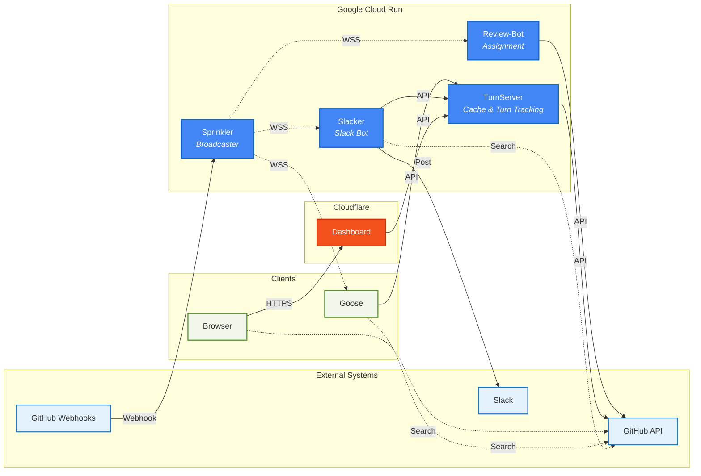
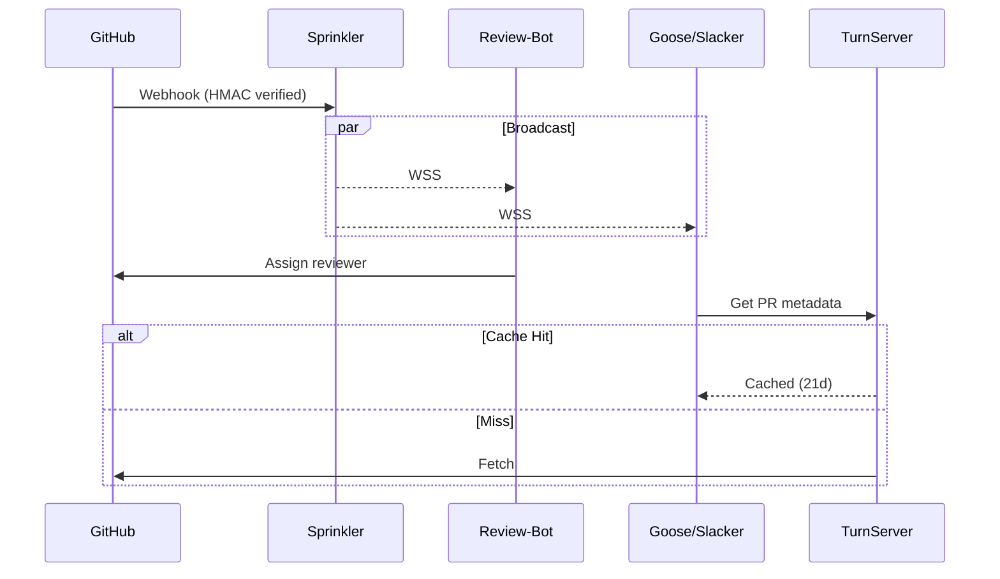
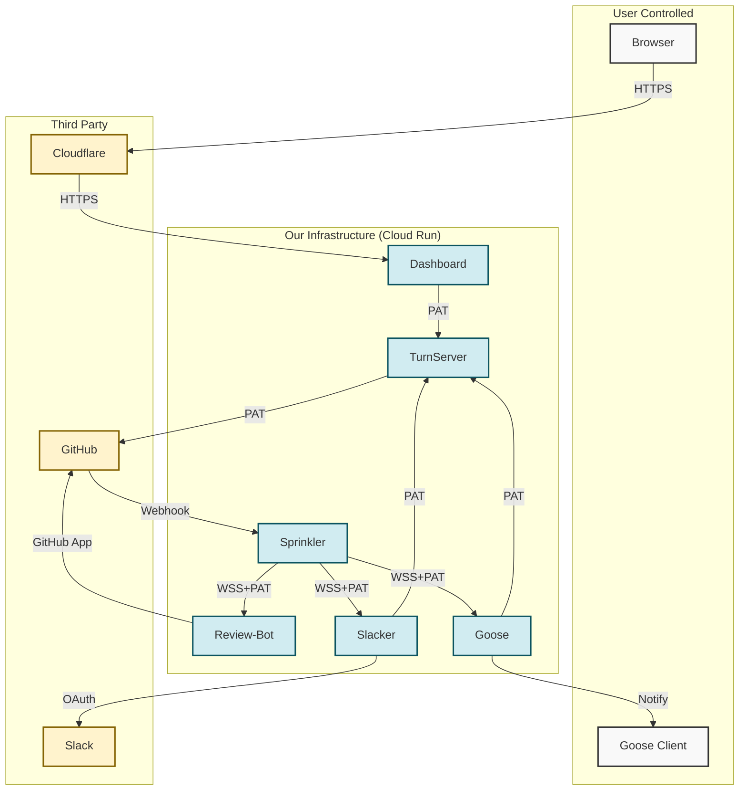

# Ready To Review Systems Architecture

## Overview

Event-driven PR review system running on **Google Cloud Run**. GitHub webhooks flow through Sprinkler's WebSocket broadcast to notification services (Goose, Slacker) and Review-Bot for intelligent reviewer assignment. TurnServer provides turn tracking and PR metadata cache. Dashboard served via Cloudflare.

Built with [ko](https://ko.build/) and [Chainguard Images](https://www.chainguard.dev/chainguard-images) for supply chain security.

**Security:** Never store source code. Cache only PR metadata (21 days max). Zero Trust architecture.

## System Architecture

## Components

- **Sprinkler:** Webhook receiver with HMAC-SHA256 verification. Broadcasts via WSS to subscribers. Auth: GitHub PAT.
- **Review-Bot:** PR analysis and reviewer assignment. WebSocket subscriber. Scores candidates by file expertise and workload. Auth: GitHub App (JWT + installation tokens).
- **TurnServer:** Turn calculator + PR metadata cache. Two-tier cache (memory + disk, 21 days). Auth: GitHub PAT.
- **Goose/Slacker:** Notification services (desktop/Slack). Query TurnServer for data.
- **Dashboard:** Web UI behind Cloudflare. Queries TurnServer.

## Data Flow

## Data Storage

| Data Type | Retention | Location |
|-----------|-----------|----------|
| PR metadata | 21 days | TurnServer (memory + disk) |
| Review-Bot cache | 3 days (metadata), 6h (lists) | Memory |
| **Source code/diffs** | **Never** | **N/A** |
| Webhook events | Real-time only | Ephemeral |
| Auth tokens | Persistent | Encrypted at rest |

## Technology Stack

- **Language:** Go
- **Build:** [ko](https://ko.build/) - builds from source without Dockerfiles
- **Base images:** [Chainguard Images](https://www.chainguard.dev/chainguard-images) - distroless, zero CVEs
- **Runtime:** Google Cloud Run
- **TLS:** 1.2+ minimum, managed by Google/Cloudflare

## Security

**Authentication:**
- Review-Bot: GitHub App (JWT + installation tokens, auto-refresh)
- TurnServer: GitHub PAT
- Sprinkler: GitHub PAT
- Dashboard: GitHub OAuth

**GitHub Permissions:**
- Review-Bot: Repo (read/write), PRs (read/write), Org (read)
- TurnServer: Repo/PRs/Checks (read)
- Sprinkler: Org membership (read) for token validation

**Network:**
- All traffic: HTTPS/WSS (TLS 1.2+)
- Cloud Run: Public endpoints with Google-managed TLS
- Dashboard: Cloudflare DDoS protection

**Trust Boundaries:**

